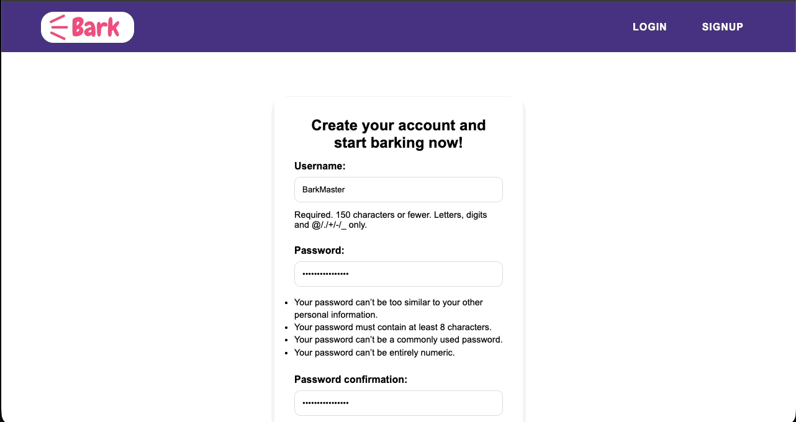
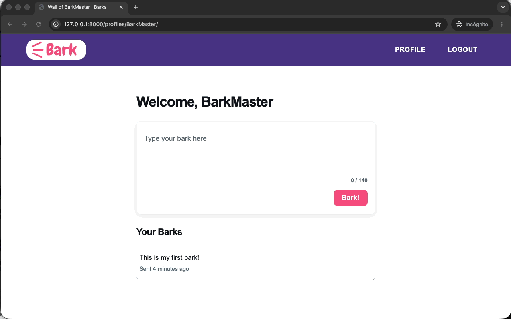
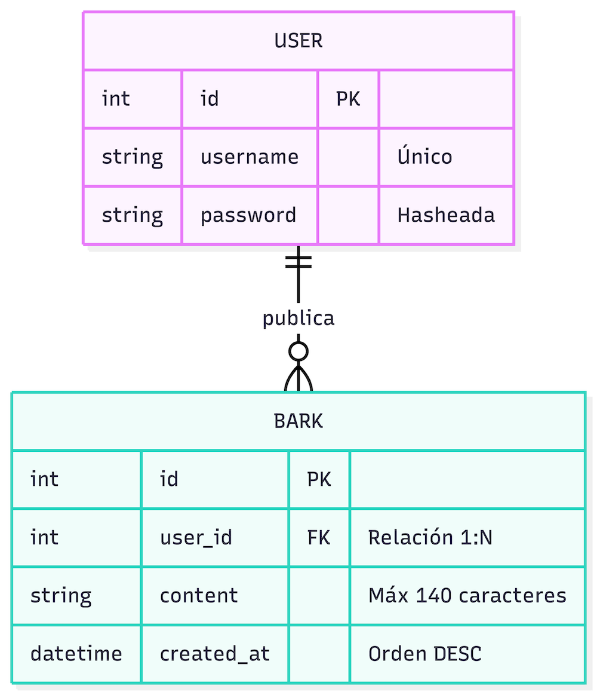
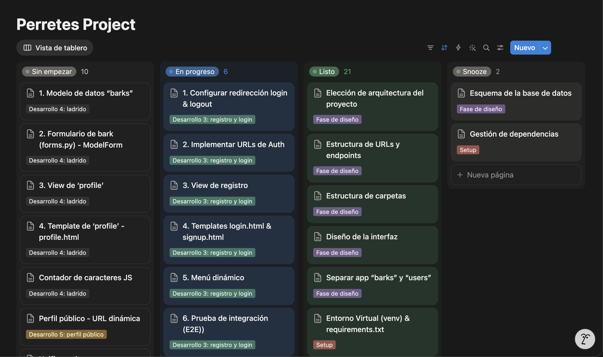
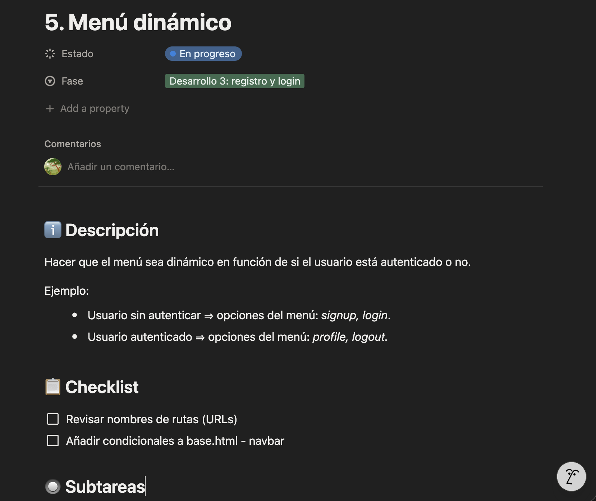

## 🐾 ¿Qué es Perretes?

> **Perretes** es una red social para amantes de los perros que quieren compartir su estilo de vida con el resto del mundo. 🐕✨

Perretes ofrece una aplicación web en la que los usuarios pueden:

* 📝 **Publicar mensajes cortos**
* 🌐 **Explorar el feed de otros usuarios**

## ✨ Características principales

---

- **Implementación de Arquitectura MVT** (Model, View, Template) propio de Django.
- **Autenticación y gestión de sesiones** nativo de Django (Django Authentication System).
- **Estructura de URLs dinámicas e intuitivas** (`/profile/<username>/`) para una navegación sencilla y segmentada por recursos.
- **Optimización de rendimiento de consulta** a base de datos mediante la ordenación de registros (`-created_at`). Aplicando el principio **DRY** para evitar hacer la ordenación en el backend.
- **Manejo de errores** (custom **404**.html) mediante el uso de `handler404`.
- **Arquitectura preparada para el despliegue** con *WhiteNoise*.

--- 

## 🛠️ Tecnologías (Tech Stack)

| Capa / Componente | Tecnologías                                                 |
| :--- |:------------------------------------------------------------|
| **🎨 Frontend** | HTML, CSS, JavaScript                                       |
| **⚙️ Backend** | Python, Django                                              |
| **🗄️ Base de datos** | SQLite                                                      |
| **🧰 Otras tecnología** | Git, WhiteNoise, Mermaid js, Fixture, PyCharm (IDE)         |

## ⚙️ Instalación y configuración

Sigue estos pasos para configurar el entorno de desarrollo en local.

---

### 1. 📋 Prerrequisitos

Asegúrate de tener instalado **Python** y **Git** en tu sistema.

### 2. 🔀 Clonar el repositorio

```bash
git clone https://github.com/borjabf/perretes-social-network.git
```

### 3. 🌐 Crear y activar el entorno virtual

> 💡 **Nota:** Es una buena práctica crear un entorno virtual para aislar por completo las dependencias del proyecto.

#### **En Linux/macOS:**
```bash
# Crear entorno virtual
python3 -m venv venv

# Activar entorno virtual
source venv/bin/activate
```

#### **En Windows:**
```bash
# Crear entorno virtual
python -m venv venv

# Activar entorno virtual
venv\Scripts\activate
```

---

### 4. 📦 Instalar dependencias

Instala los paquetes y librerías necesarios recogidos en el archivo `requirements.txt`.

```bash
pip install -r requirements.txt
```
> 💡 **Nota:** Asegúrate de estar dentro del entorno virtual en la terminal.

---

### 5. 🗄️ Aplicar migraciones

Crea la base de datos local (SQLite) y las tablas necesarias para el proyecto.

```bash
python manage.py migrate
```

---

### 6. 👤 Crear un superusuario (Opcional)

Para acceder al panel de administración de Django (`/admin`).

```bash
python manage.py createsuperuser
```

---

### 7. 📥 Agregar datos dummies a la base de datos

Importa el `.json` con los datos dummies generados con Fixture.

```bash
python manage.py loaddata barks_dummy.json
```

---

### 8. ⚡ Compilar archivos estáticos

Al estar el proyecto configurado en modo de producción (`DEBUG = False`) para ver las páginas de error personalizadas, es necesario compilar los archivos **CSS/JS** a través de WhiteNoise.

```bash
python manage.py collectstatic --noinput
```

## 🚀 Ejecutar aplicación

Para iniciar el servidor de desarrollo local, ejecuta el siguiente comando en tu terminal:

```bash
python manage.py runserver
```

---

### 🌐 Acceso a la aplicación

Una vez que el servidor esté en ejecución, abre tu navegador web y entra a la siguiente dirección:

👉 [http://127.0.0.1:8000/](http://127.0.0.1:8000/)

> 💡 **Tip:** También puedes acceder utilizando [http://localhost:8000/](http://localhost:8000/) según la configuración de tu sistema.

## 📸 Vista previa

Aquí puedes ver algunos ejemplos de las funcionalidades de la aplicación:

---

### 🔐 Registro, publicación de un Bark e historial
Muestra el flujo completo desde el registro de un nuevo usuario, la creación del primer *Bark* y su renderizado inmediato en el historial del perfil.



---

### 👥 Vista del muro de Barks de otro usuario
Muestra cómo interactúa la aplicación al visitar perfiles públicos de otros usuarios de la red social.


---

### 🚫 Control de errores 404 y cierre de sesión
Muestra el comportamiento del sistema ante el intento de acceder al muro de un usuario no registrado (pantalla custom 404) y el proceso de *logout*.



## 🧪 Guía de pruebas

Sigue este flujo paso a paso para validar las características y el comportamiento del proyecto en tu entorno local:

---

### 1. 🌐 Acceso inicial
Abre tu navegador web e ingresa a la dirección local de la aplicación:
👉 [http://127.0.0.1:8000/](http://127.0.0.1:8000/)

### 2. 🔐 Registro e inicio de sesión
Crea una cuenta nueva desde el formulario de registro. Puede utilizar alguna de las siguientes credenciales de ejemplo, o la que tú prefieras:

| Username | Password |
| :--- | :--- |
| `FetchChampion` | `Woof_Catcher_2026!` |
| `BarkMaster` | `one&Chew_Secure7` |
| `BoneCollector` | `ActivePaws_987*` |

> 📥 *Nota: Una vez completado el acceso, el sistema te redirigirá automáticamente a tu propio perfil privado.*

### 3. 📝 Publicar un Bark
Prueba la funcionalidad principal: escribe y publica tu primer **Bark!**. Comprueba cómo se añade dinámicamente y de forma cronológica a tu historial de publicaciones.

### 4. 👥 Explorar el muro de otros usuarios
Comprueba la privacidad y vista pública visitando perfiles de terceros.
> ⚠️ **Requisito:** Asegúrate de haber ejecutado el poblado de la base de datos (Paso 7 de la sección de instalación).

* Modifica la barra de direcciones de tu navegador (URL) y sustituye tu nombre de usuario por alguno de estos perfiles reales:
  * `GoldenLover`
  * `RoverRanger`
  * `DaisyTheFluff`

### 5. 🚫 Simulación de error 404
Fuerza de manera intencionada el manejador de excepciones buscando el muro del usuario inexistente `CatLover`. Tras comprobarlo, haz clic en el botón **“Back to my profile”**.

### 6. 🚪 Flujo de Logout
* Cierra la sesión activa haciendo clic sobre el botón **“LOGOUT”** en el menú de navegación.
* Comprueba la persistencia volviendo a iniciar sesión con tu *username* y *password*.

## 🗺️ Arquitectura de Rutas (Endpoints)

| Ruta URL | Nombre | Método HTTP | Controlador (View) | Descripción y Comportamiento &nbsp;&nbsp;&nbsp;&nbsp;&nbsp;&nbsp;&nbsp;&nbsp;&nbsp;&nbsp;&nbsp;&nbsp;&nbsp;&nbsp;&nbsp;&nbsp;&nbsp;&nbsp;&nbsp;&nbsp;&nbsp;&nbsp;&nbsp;&nbsp;&nbsp;&nbsp;&nbsp;&nbsp;&nbsp;&nbsp;&nbsp;&nbsp;&nbsp;&nbsp;&nbsp;&nbsp;&nbsp;&nbsp;&nbsp;&nbsp;&nbsp;&nbsp;&nbsp;&nbsp;&nbsp;&nbsp;&nbsp;&nbsp;&nbsp;&nbsp;&nbsp;&nbsp;&nbsp;&nbsp; |
| :--- | :--- | :---: | :--- | :--- |
| `/` | `signup_home` |  <br>  | `users.views.signup` | **Home Page principal.** Muestra el formulario de registro. Si el usuario ya está autenticado, lo redirige automáticamente a su propio perfil privado. |
| `/signup/` | `signup` |  <br>  | `users.views.signup` | **Endpoint de registro.** El método `POST` procesa, valida la integridad de los datos (`UserCreationForm`), persiste al nuevo usuario en la base de datos e inicia la sesión automáticamente. |
| `/profiles/<username>/` | `profiles` |  <br>  | `users.views.profile` | **Muro de Barks.**<br><br>• **GET**: Renderiza el muro dinámico leyendo el parámetro `<username>`. Si es el perfil propio, inyecta el formulario para publicar Barks. Si es otro usuario, solo muestra el historial de Barks.<br>• **POST**: Procesa la creación de nuevos Barks.<br><br>🔒 *Requiere autenticación (`@login_required`).* |
| `/login-redirect/` | `login_redirect` |  | `users.views.login_redirect` | **Despachador intermedio.** Captura la sesión del usuario inmediatamente después del login con éxito, y ejecuta la redirección hacia su perfil.<br><br>🔒 *Requiere autenticación (`@login_required`).* |

## 🧠 Decisiones técnicas

Algunas de las decisiones técnicas en el desarrollo del proyecto:

---

### 🏗️ Arquitectura MVT (Model, View, Template)

- **Decisión:** desarrollar el proyecto siguiendo la arquitectura **MVT**, desacoplando el desarrollo en dos apps independientes: “barks”, “users”.
- **Justificación:** se valoraron otras arquitectura como la hexagonal, pero debido a la necesidad de ser ágil en el desarrollo y tener listo un **MVP**, se eligió el patrón nativo de Django **MVT**. Algunas de sus ventajas que ayudan a ahorrar tiempo de desarrollo son: enrutador integrado, **ORM** para base de datos, sistema de plantillas e inyección de datos resueltos, panel de administrador de base de datos integrado.

---

### 💾 Base de datos SQLite

- **Decisión:** utilizar la base de datos SQLite frente a otras opciones, como PostgreSQL o MySQL.
- **Justificación:** al tratarse de desarrollar un **MVP** de manera ágil, y de poder clonar y levantar el proyecto con facilidad (sin necesitar un servidor de base de datos adicional), se eligió SQLite para el proyecto, siguiendo el principio **KISS**. Además, gracias a **ORM** de Django, al estar desacoplada la lógica de negocio de la base de datos, si el proyecto necesita escalar se podría cambiar fácilmente a otra base de datos con más capacidad, como PostgreSQL.



---

### 🍕 Vertical Slicing - Desarrollo por funcionalidad

- **Decisión:** hacer un desarrollo por funcionalidad de la aplicación end-to-end
- **Justificación:** ante la necesidad de hacer un desarrollo ágil, se eligió hacerlo por funcionalidades completas y de manera incremental. De esta forma se entrega valor real al **MVP** desde el principio y se minimiza el riesgo de no llegar al **MVP** por haber desarrollado por capas. Para implementar el Vertical Slicing se ha utilizado la metodología Scrum, a través de un table kanban en Notion.




---

### 📦 Implementación de WhiteNoise para la gestión de archivos estáticos

- **Decisión:** utilizar WhiteNoise para servir los archivos estáticos directamente desde la instancia de Django cuando `DEBUG = False`.
- **Justificación:** al implementar la pantalla custom de error **404** (cuando se introduce un *username* que no existe en la base de datos), el servidor no la mostraba porque por defecto Django está en modo `DEBUG = True`, y muestra pantallas de error de desarrollo (pantalla amarilla). Por tanto, para poder mostrar la pantalla custom **404** se tiene que cambiar a `DEBUG = False`. Pero esto hace que Django no sirva archivos estáticos en producción, y no se cargan los archivos .css y .js. Para poder servir estos archivos en producción se ha implementado WhiteNoise.

## 📋 Roadmap de mejoras

---

- [ ]  **Asincronía con JS (AJAX):** cuando un usuario publica un Bark desde su perfil, agregar ese Bark al feed de Barks sin recargar la página.
- [ ]  **Feed general:** página que muestre todos los Barks de todos los usuarios de la plataforma, ordenados por fecha de publicación.
- [ ]  **Editar / eliminar Bark:** usuarios pueden editar sus Barks publicados en un intervalo de tiempo concreto, o pueden eliminarlos.
- [ ]  **Scroll infinito:** por defecto cargar 10 barks. Cuando usuario llega hasta al último, se cargan otros 10 más.
- [ ]  **Menciones en Barks:** usuario puede mencionar a otro usuario en un Bark (@usuario). Al pinchar el usuario mencionado se redirige a su perfil.
- [ ]  **Diseño responsive:** implementar un diseño responsive para versión móvil.

## 👤 Autor

**Borja Bajo** — *Software Developer*

[](https://www.linkedin.com/in/borja-bajo)